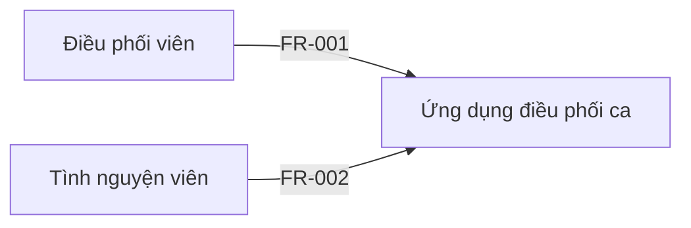

# Software Requirements Specification — Ứng dụng điều phối ca (trích đoạn)

> **ILLUSTRATIVE — NOT APPROVED.** Trích đoạn minh họa định dạng, dựng từ `generic-product-brief.md` (dữ liệu giả lập). Không phải yêu cầu đã được stakeholder chấp thuận. Kiểm tra bằng `validate_srs.py --partial`.

## 1. Document Control — Kiểm soát tài liệu

| Field | Value |
|---|---|
| Project | Ứng dụng điều phối ca (giả lập) |
| Document version | 0.2 |
| Status | DRAFT — NOT APPROVED |
| Current phase | Phase 1 — Discovery |
| Last gate passed | G0 |
| Product type | Ứng dụng web |
| Domain | Not confirmed |
| Language | vi |
| Business owner | Trưởng ban điều phối |
| Approver | Chưa xác định (Q-001) |
| SRS location | docs/srs/srs.md |
| Skill version | srs-analysis 1.0.0 |

## 9. Functional Requirements — Yêu cầu chức năng

### FR-001 — Tạo ca làm việc
- **Statement:** Hệ thống phải cho phép điều phối viên tạo ca làm việc cho một hoạt động, gồm thời gian và số chỗ.
- **Rationale:** Thay cho bảng tính dùng chung đang gây trùng và thiếu người.
- **Source:** SRC-001
- **Priority:** Must
- **Status:** Proposed
- **Related:** FR-002
- **Acceptance criteria:**
  - AC-FR-001-01: Given điều phối viên đã đăng nhập, when tạo ca với thời gian và số chỗ hợp lệ, then ca hiển thị trong danh sách ca còn chỗ.
  - AC-FR-001-02: Given điều phối viên đã đăng nhập, when tạo ca có thời gian kết thúc trước thời gian bắt đầu, then hệ thống từ chối và nêu lý do.
- **Verification:** Test

### FR-002 — Đăng ký vào ca
- **Statement:** Hệ thống phải cho phép tình nguyện viên đăng ký vào ca còn chỗ.
- **Rationale:** Giảm việc chia ca thủ công.
- **Source:** SRC-001
- **Priority:** Must
- **Status:** Proposed
- **Related:** Q-002
- **Acceptance criteria:**
  - AC-FR-002-01: Given ca còn chỗ, when tình nguyện viên đăng ký, then đăng ký được ghi nhận với trạng thái theo quyết định ở Q-002.
  - AC-FR-002-02: Given ca đã hết chỗ, when tình nguyện viên đăng ký, then hệ thống từ chối và thông báo ca đã đủ người.
- **Verification:** Test

## 21. Models and Diagrams — Mô hình và sơ đồ

### DIA-001 — Context diagram
- **Type:** Context
- **Source:** FR-001, FR-002
- **Status:** Proposed

## 24. Open Questions — Câu hỏi mở

| ID | Question | Priority | Ask whom | Status | Answer / Notes |
|---|---|---|---|---|---|
| Q-001 | Ai có quyền phê duyệt SRS? | P0 | Trưởng ban điều phối | Open | |
| Q-002 | Đăng ký vào ca có cần điều phối viên duyệt không? Hai stakeholder đang nói khác nhau (SRC-001). | P0 | Trưởng ban điều phối | Open | Mâu thuẫn cần người có thẩm quyền quyết định |
| Q-003 | Ai được hủy hoặc sửa ca đã có người đăng ký? | P1 | Trưởng ban điều phối | Open | |

## 26. Sources — Nguồn thông tin

| ID | Type | Description | Date | Provided by (role) | Notes |
|---|---|---|---|---|---|
| SRC-001 | Brief | Email brief của tổ chức (giả lập) | 2026-10-01 | Điều phối viên | Dữ liệu giả lập |

## 28. Traceability Matrix — Ma trận truy vết

| Goal / Source | Requirement | User story | Acceptance criteria | Diagram | Verification | Design ref | Test ref |
|---|---|---|---|---|---|---|---|
| SRC-001 | FR-001 | | AC-FR-001-01, AC-FR-001-02 | DIA-001 | Test | | |
| SRC-001 | FR-002 | | AC-FR-002-01, AC-FR-002-02 | DIA-001 | Test | | |
