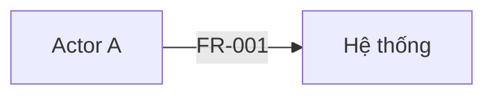

# Conventions — Quy ước dùng chung cho BRD / SRS / Diagrams

**Mục đích:** nguồn sự thật duy nhất về quy ước ID, định dạng requirement, Document Control và các sổ đăng ký — dùng chung cho cả 3 tài liệu (`brd-template.md`, `srs-template.md`, `diagrams-template.md`). Validator (`scripts/validate_docs.py`) kiểm tra theo đúng file này.

**Khi dùng:** Phase 0 (tạo 3 file), Phase 3 (soạn), Phase 4 (rà soát), Phase 6 (cập nhật sau CR).

## Mục lục

- A1. Ba file, ngôn ngữ, vị trí lưu
- A2. Danh sách section theo từng loại tài liệu
- A3. Quy tắc `Not applicable`
- A4. Ngữ pháp ID
- A5. Định nghĩa và tham chiếu ID — xuyên suốt 3 file
- A6. Khối requirement
- A7. Priority và status
- A8. Các sổ đăng ký (bảng)
- A9. Document Control (phần mở đầu, không đánh số)
- A10. Khối sơ đồ
- A11. Phê duyệt và version
- A12. Ghi nhãn thông tin chưa xác nhận

## A1. Ba file, ngôn ngữ, vị trí lưu

Dự án có **ba file Markdown UTF-8** tách biệt:

| File | Vai trò | Khung |
|---|---|---|
| `docs/brd/brd.md` | Business Requirement Document — yêu cầu nghiệp vụ mức cao | `brd-template.md` |
| `docs/srs/srs.md` | Software Requirements Specification — theo chuẩn 6 phần | `srs-template.md` |
| `docs/diagrams/diagrams.md` | Toàn bộ sơ đồ phân tích (Mermaid) | `diagrams-template.md` |

Hỏi người dùng vị trí lưu ở G0 nếu repo có quy ước khác (mặc định như trên). Khi duyệt, lưu thêm bản chụp mỗi file dạng `*-vX.Y.md`, không sửa bản chụp đó nữa.

Nội dung mặc định tiếng Việt; tên trường, giá trị status/priority, tiền tố ID và cú pháp phê duyệt giữ tiếng Anh để validator nhận diện. Heading section song ngữ: `## <số>. <English title> — <Tiếng Việt>`. Validator nhận section theo **số** và **English title** (riêng cho từng loại tài liệu — xem A2); phần tiếng Việt có thể đổi.

## A2. Danh sách section theo từng loại tài liệu

Mỗi loại tài liệu có đúng một danh sách section cố định, theo đúng số thứ tự — xem bảng chi tiết trong file khung tương ứng:

- `brd-template.md` — 10 section (Introduction, Business Context, Goals, Scope, Stakeholders, Glossary, Assumptions, High-Level Business Processes, Risks, Approval Record).
- `srs-template.md` — 6 section (Introduction, High-Level Requirements, Functional Requirements, Non-Functional Requirements, Security Requirements, Other Requirements and Appendix).
- `diagrams-template.md` — 1 section (Diagrams).

Không xóa section. Không thêm section ngoài danh sách của loại tài liệu đó (validator báo `SEC007` nếu có).

## A3. Quy tắc `Not applicable`

- Section không áp dụng ghi đúng một dòng: `Not applicable — <lý do cụ thể>`. Lý do phải nói vì sao không áp dụng cho dự án này, không ghi chung chung.
- Section rỗng (không nội dung, không `Not applicable`) là lỗi cần sửa (`SEC004`).
- Mỗi section trong file khung ghi rõ có được phép `Not applicable` hay không (cột cuối trong bảng danh sách section). Ghi `Not applicable` ở section không cho phép là lỗi (`SEC006`).

## A4. Ngữ pháp ID

| Tiền tố | Ý nghĩa | Thường ở file | Mẫu | Regex |
|---|---|---|---|---|
| GOAL | Mục tiêu | BRD | `GOAL-001` | `GOAL-\d{3}` |
| FR, BR, DR, IR, UIR, NFR | Requirement | SRS | `FR-001`, `FR-ABC-001` | `(FR\|BR\|DR\|IR\|UIR\|NFR)-([A-Z][A-Z0-9]{1,5}-)?\d{3}` |
| US | User story | SRS | `US-001` | `US-\d{3}` |
| UC | Use case | SRS | `UC-001` | `UC-\d{3}` |
| AC | Acceptance criterion | SRS | `AC-FR-001-01`, `AC-US-002-01` | `AC-<ID requirement hoặc US>-\d{2}` |
| DIA | Sơ đồ | Diagrams | `DIA-001` | `DIA-\d{3}` |
| ASM | Giả định | BRD | `ASM-001` | `ASM-\d{3}` |
| Q | Câu hỏi mở | SRS | `Q-001` | `Q-\d{3}` |
| RISK | Rủi ro | BRD | `RISK-001` | `RISK-\d{3}` |
| DEC | Quyết định | SRS | `DEC-001` | `DEC-\d{3}` |
| SRC | Nguồn thông tin | SRS | `SRC-001` | `SRC-\d{3}` |
| UXP | Đầu vào thiết kế | SRS | `UXP-001` | `UXP-\d{3}` |
| CR | Change request | SRS | `CR-001` | `CR-\d{3}` |

Cột "Thường ở file" là **quy ước thực hành**, không phải ràng buộc cứng của validator — validator chỉ đảm bảo mỗi ID được định nghĩa đúng một lần trong toàn bộ 3 file và mọi tham chiếu có nơi định nghĩa, không quan tâm ID đó nằm ở file nào.

- Số luôn có đủ chữ số (`FR-001`, không phải `FR-1`).
- Mã module (tùy chọn) gồm 2–6 ký tự in hoa/số, bắt đầu bằng chữ cái.
- **Không tái sử dụng ID** đã dùng, kể cả khi requirement bị loại. Đổi status thành `Rejected` hoặc `Superseded`.

## A5. Định nghĩa và tham chiếu ID — xuyên suốt 3 file

Một ID được **định nghĩa** ở đúng một chỗ, trong đúng một file, theo một trong ba cách:

1. **Heading H3** bắt đầu bằng ID: `### FR-001 — <tên ngắn>` (dùng cho FR, BR, DR, IR, UIR, NFR, US, UC, DIA, CR).
2. **Ô đầu tiên của một dòng bảng** (GOAL, ASM, UXP, RISK, Q, DEC, SRC) — ở bất kỳ bảng nào có cột đầu chứa ID đúng tiền tố, bất kể file hay vị trí trong file.
3. **Dòng AC** trong khối requirement hoặc user story cha: `- AC-FR-001-01: Given …, when …, then …`.

Mọi lần xuất hiện khác, **ở bất kỳ file nào trong 3 file**, là **tham chiếu**. Tham chiếu tới ID chưa được định nghĩa ở file nào là lỗi. ID trong khối code thường (không phải `mermaid`) bị bỏ qua; ID trong khối `mermaid` được tính là tham chiếu.

Nếu một trong 3 file chưa được cung cấp cho validator (ví dụ đang soạn từng file một), tham chiếu treo tới ID lẽ ra thuộc file đó chỉ là cảnh báo (WARNING), không phải lỗi cứng (ERROR) — giống `--partial`.

## A6. Khối requirement

Áp dụng cho FR, BR, DR, IR, UIR, NFR. Mỗi khối một nghĩa vụ duy nhất.

```markdown
### FR-001 — <Tên ngắn>
- **Statement:** Hệ thống phải <một nghĩa vụ có thể kiểm thử>.
- **Rationale:** <vì sao cần>
- **Source:** SRC-001
- **Priority:** Must
- **Status:** Proposed
- **Related:** UC-001, BR-001
- **Acceptance criteria:**
  - AC-FR-001-01: Given <bối cảnh>, when <hành động>, then <kết quả quan sát được>.
- **Verification:** Test
```

| Trường | Bắt buộc với | Ghi chú |
|---|---|---|
| Statement | Tất cả | Một câu "phải"; không mô tả giải pháp kỹ thuật |
| Rationale | Khuyến nghị | |
| Source | Tất cả | ID `SRC-`, có thể kèm `Q-`/`DEC-` |
| Priority | Tất cả | Xem A7 |
| Status | Tất cả | Xem A7 |
| Related | Khuyến nghị | ID liên quan |
| Acceptance criteria | FR (bắt buộc); BR, DR, IR, UIR (AC **hoặc** Verification) | Định nghĩa AC tại chỗ hoặc tham chiếu AC khác |
| Verification | NFR (bắt buộc); khuyến nghị cho loại khác | Test, Demonstration, Inspection, Analysis |
| Target, Metric, Category | NFR | Target có thể là `TBD (Q-xxx)` |
| Classification, Retention | DR (khi biết) | |
| Counterpart, Direction, Failure handling | IR (khi biết) | |
| Superseded by | Khi Status = Superseded | ID thay thế |

Khối **use case**:

```markdown
### UC-001 — <Tên use case>
- **Actors:** <vai trò>
- **Trigger:** <sự kiện khởi đầu>
- **Preconditions:** <điều kiện>
- **Main flow:** 1. … 2. …
- **Alternate flows:** …
- **Exception flows:** …
- **Postconditions:** …
- **Related:** FR-001
- **Source:** SRC-001
- **Status:** Proposed
```

Khối **user story** (xem `user-story-standard.md`):

```markdown
### US-001 — <Tên ngắn>
- **Story:** As a <vai trò>, I want <khả năng>, so that <giá trị>.
- **Related:** FR-001
- **Priority:** Must
- **Status:** Proposed
- **Acceptance criteria:**
  - AC-US-001-01: Given …, when …, then …
```

## A7. Priority và status

| Loại | Giá trị hợp lệ |
|---|---|
| Priority requirement / story | `Must`, `Should`, `Could`, `Won't` |
| Priority câu hỏi | `P0`, `P1`, `P2` |
| Status requirement / UC / story / sơ đồ | `Proposed`, `Confirmed`, `Approved`, `Deferred`, `Rejected`, `Superseded` |
| Status giả định | `Open`, `Confirmed`, `Rejected` |
| Status câu hỏi | `Open`, `Answered`, `Deferred`, `Risk accepted` |
| Status UXP | `Open`, `Confirmed`, `Superseded` |
| Status CR | `Proposed`, `Approved`, `Rejected`, `Deferred`, `Implemented` |
| Trạng thái coverage | `Answered`, `TBD`, `Not applicable`, `Deferred` |
| Trạng thái tài liệu (mỗi file) | `DRAFT — NOT APPROVED`, `APPROVED`, `ON HOLD` |

Ý nghĩa status requirement:
- `Proposed`: do Claude hoặc BA đề xuất, chưa có người có thẩm quyền xác nhận.
- `Confirmed`: người có thẩm quyền đã xác nhận nội dung (ghi nguồn).
- `Approved`: thuộc một baseline đã được phê duyệt.

**Ba file nên có cùng `Document version` và `Status`** vì được duyệt đồng thời ở G5 (xem A11). Validator cảnh báo (`DOC004`, `DOC005`) nếu khác nhau giữa các file đang có.

## A8. Các sổ đăng ký (bảng)

Các bảng này có thể đặt ở BRD hoặc SRS theo gợi ý ở A4 ("Thường ở file"), validator không ép buộc.

**Goals**

| ID | Goal | Success metric | Baseline | Target | Source | Status |
|---|---|---|---|---|---|---|

**Assumptions**

| ID | Assumption | Source | Confirm with | Status |
|---|---|---|---|---|

**Design inputs / UX brief** — `Type`: `Constraint`, `Preference`, `Reference`

| ID | Type | Description | Source | Status |
|---|---|---|---|---|

**Risks**

| ID | Risk | Impact | Likelihood | Mitigation | Owner | Status |
|---|---|---|---|---|---|---|

**Open questions** — `Ask whom` ghi vai trò nên trả lời

| ID | Question | Priority | Ask whom | Status | Answer / Notes |
|---|---|---|---|---|---|

**Decision log**

| ID | Date | Decision | Decided by (role, as stated) | Related |
|---|---|---|---|---|

**Sources** — `Type`: `Brief`, `Meeting`, `Document`, `Existing system`, `Public research`, `Other`

| ID | Type | Description | Date | Provided by (role) | Notes |
|---|---|---|---|---|---|

**Elicitation coverage** — một dòng cho mỗi chủ đề/topic đã hoặc cần thu thập (tự do, không còn gắn cứng theo số section như bản 30-section cũ)

| Topic | Status | Notes / Q-ID |
|---|---|---|

**Traceability matrix** — mọi requirement chưa `Rejected`/`Superseded` và mọi GOAL phải xuất hiện ở cột `Requirement` hoặc `Goal / Source`

| Goal / Source | Requirement | User story | Acceptance criteria | Diagram | Verification | Design ref | Test ref |
|---|---|---|---|---|---|---|---|

**Approval record** (đặt trong SRS, áp dụng đồng thời cho cả 3 file) — `Decision`: `APPROVE`, `REQUEST CHANGES`, `HOLD`

| Version | Decision | Approver (role, as stated) | Date | Notes |
|---|---|---|---|---|

**Permissions** (đặt trong SRS §5 Security Requirements) — giá trị ô: `Allow`, `Deny`, `Conditional (BR-xxx)`, `TBD (Q-xxx)`. Không bao giờ mặc định `Allow` khi chưa rõ.

**State transitions** (đặt trong SRS §6, mục "Workflow chi tiết")

| From | Event / Trigger | Condition | To | Actor | Related |
|---|---|---|---|---|---|

## A9. Document Control (phần mở đầu, không đánh số)

Mỗi file bắt đầu bằng một bảng Document Control **trước** heading `## 1. ...` — không phải một section đánh số, để section 1 của SRS/BRD đúng là "Introduction" như chuẩn yêu cầu:

```markdown
# <Loại tài liệu> — <Tên dự án>

| Field | Value |
|---|---|
| Project | <tên dự án> |
| Document type | BRD / SRS / Diagrams |
| Document version | 0.1 |
| Status | DRAFT — NOT APPROVED |
| Current phase | Phase 0 — Intake |
| Last gate passed | None |
| Related documents | <đường dẫn 2 file còn lại> |
| Domain | Not confirmed |
| Business owner | <vai trò> |
| Approver | <vai trò> |
| Language | vi |
| Skill version | srs-analysis 2.0.0 |

### Revision History

| Version | Date | Author (role) | Changes |
|---|---|---|---|
| 0.1 | <Ngày> | <Vai trò> | Khởi tạo |

## 1. Introduction — Giới thiệu
...
```

`validate_docs.py` tìm bảng `| Field | Value |` này ở phần trước heading `## 1.`; thiếu thì báo `DOC003`.

`Domain` ghi `Not confirmed` cho đến khi người dùng xác nhận; sau đó ghi `Confirmed: <tên lĩnh vực theo cách người dùng gọi>` ở **cả 3 file** (giữ nhất quán). Xem `domain-discovery-guide.md` mục 3 cho cách xác nhận và nơi đưa nội dung đặc thù lĩnh vực (BRD §2 Business Context).

## A10. Khối sơ đồ

Đặt trong `diagrams.md`, dưới section `## 1. Diagrams — Sơ đồ`. Xem `diagram-standard.md` cho danh mục và điều kiện kích hoạt.

````markdown
### DIA-001 — Context diagram
- **Type:** Context
- **Source:** FR-001, IR-001
- **Status:** Proposed


````

Loại Mermaid được phép trong v2: `flowchart`, `graph`, `sequenceDiagram`, `stateDiagram-v2`, `stateDiagram`, `erDiagram`, `gantt`. `diagrams.md` phải có ít nhất một sơ đồ `Type: Context`.

## A11. Phê duyệt và version

- Cú pháp chính thức tại G5 (version phải khớp bản đang trình, **áp dụng cho cả 3 file cùng lúc** — không duyệt riêng từng file):
  - `APPROVE BRD+SRS vX.Y` hoặc `DUYỆT BRD+SRS vX.Y`
  - `REQUEST CHANGES: <nội dung>` hoặc `YÊU CẦU SỬA: <nội dung>`
  - `HOLD` hoặc `TẠM DỪNG`
- Bản nháp: 0.1, 0.2, … Lần duyệt đầu: 1.0. Mỗi CR được duyệt: tăng số phụ (1.1, 1.2). Chỉ tăng số chính khi người duyệt quyết định tái baseline.
- Khi duyệt: đổi `Status` thành `APPROVED` ở **cả 3 file**, thêm dòng vào Approval Record (trong SRS), cập nhật status requirement đã xác nhận thành `Approved`, lưu bản chụp cho cả 3 file.

## A12. Ghi nhãn thông tin chưa xác nhận

- Trong các section văn xuôi, câu nào chưa được xác nhận phải kèm ID giả định hoặc câu hỏi, ví dụ: "… (ASM-002)", "… chưa rõ (Q-004)".
- Đề xuất của Claude ghi rõ "Đề xuất:" ở đầu câu, hoặc nằm trong requirement có `Status: Proposed`.
- Không dùng dấu ngoặc vuông cho nhãn: validator coi `[...]` là placeholder chưa điền.
