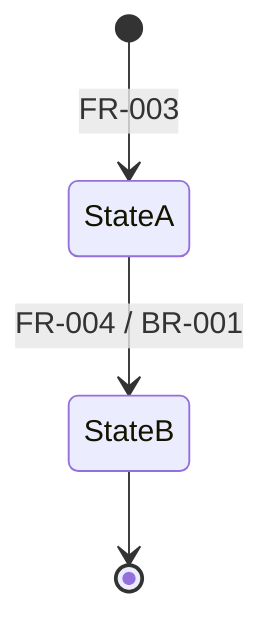
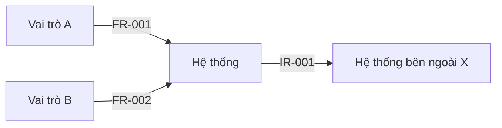
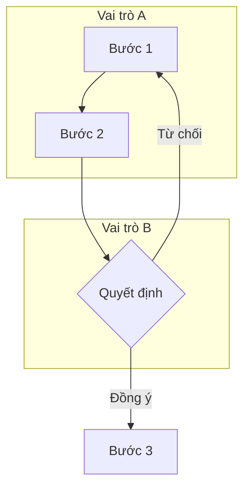
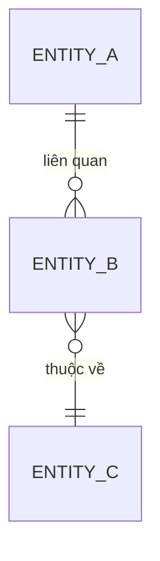
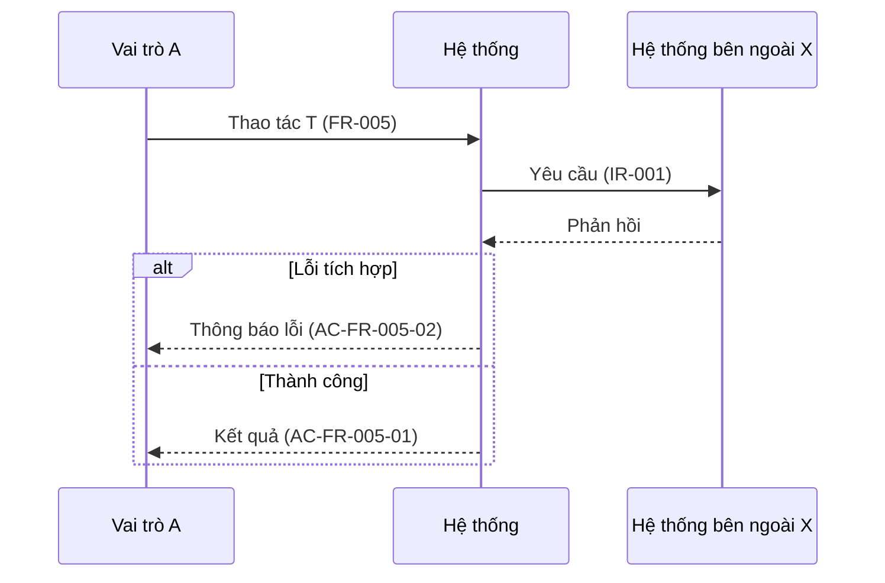

# Diagram Standard — Sơ đồ phân tích bằng Mermaid

**Mục đích:** danh mục sơ đồ, điều kiện kích hoạt, quy ước viết Mermaid và quy tắc nhất quán với văn bản.
**Khi dùng:** Phase 2 (dựng sơ đồ để xác nhận tại G2), Phase 3 (đưa vào `docs/diagrams/diagrams.md` §1), Phase 6 (cập nhật sau CR).

## Mục lục

1. Nguyên tắc
2. Danh mục sơ đồ và điều kiện kích hoạt
3. Khối sơ đồ trong SRS
4. Quy ước Mermaid
5. Mẫu theo từng loại (placeholder)
6. Kiểm tra nhất quán
7. Giới hạn của v1

## 1. Nguyên tắc

- **Văn bản là nguồn sự thật.** Các khối FR/BR/DR/IR và bảng chuyển trạng thái quyết định nội dung; sơ đồ chỉ thể hiện lại.
- **Không có phần tử "lạ".** Phần tử trên sơ đồ phải có trong văn bản. Nếu vẽ ra mới thấy thiếu, thêm vào văn bản trước (thường là `Q-` hoặc requirement `Proposed`).
- **Chỉ ở mức phân tích.** Không vẽ kiến trúc thành phần, sơ đồ triển khai, lược đồ cơ sở dữ liệu vật lý hay wireframe; đó là việc của giai đoạn thiết kế.
- Sơ đồ có status như requirement; sơ đồ dựng từ thông tin chưa xác nhận giữ `Proposed`.

## 2. Danh mục sơ đồ và điều kiện kích hoạt

Điều kiện dựa trên đặc điểm của hệ thống, không dựa trên lĩnh vực.

| Type | Khi nào cần | Loại Mermaid | Dựng từ |
|---|---|---|---|
| Context | Luôn luôn | `flowchart` | Actor (BRD §5), IR (SRS §6) |
| Use case | Có từ 2 actor hoặc nhiều use case | `flowchart` | UC (SRS §3), actor |
| Process | Có workflow nhiều bước hoặc nhiều vai trò | `flowchart` với `subgraph` làm làn | UC, FR |
| State | Có thực thể mang trạng thái | `stateDiagram-v2` | Bảng workflow chi tiết (SRS §6), BR |
| Data model | Có dữ liệu lưu trữ | `erDiagram` | Glossary (BRD §6), DR (SRS §6) |
| Sequence | Có tích hợp với hệ thống ngoài | `sequenceDiagram` | IR, luồng lỗi |
| Data flow | Có dữ liệu nhạy cảm hoặc tích hợp ngoài | `flowchart` với `subgraph` | DR, IR (SRS §6) |
| Rollout | Phát hành nhiều giai đoạn (tùy chọn) | `gantt` | Scope (BRD §4), ghi chú vận hành (SRS §6) |

Loại không áp dụng: không cần vẽ; ghi lý do trong `diagrams.md` nếu dễ gây thắc mắc (ví dụ "Không có sơ đồ State vì không có thực thể mang trạng thái").

## 3. Khối sơ đồ trong diagrams.md

````markdown
### DIA-002 — Vòng đời <đối tượng>
- **Type:** State
- **Source:** BR-001, FR-003
- **Status:** Proposed


````

- Mỗi sơ đồ có ID `DIA-`, `Type`, `Source`, `Status` và đúng một khối `mermaid`.
- Không đặt khối `mermaid` ngoài khối `DIA-`.

## 4. Quy ước Mermaid

- ID node dùng chữ không dấu, không khoảng trắng (`SYS`, `ActorA`); nhãn tiếng Việt đặt trong dấu ngoặc kép: `SYS["Hệ thống"]`.
- Nhãn cạnh ghi ID requirement liên quan khi có: `-->|"FR-001"|`.
- Chỉ dùng các loại: `flowchart`, `graph`, `sequenceDiagram`, `stateDiagram-v2`, `stateDiagram`, `erDiagram`, `gantt`.
- Giữ sơ đồ nhỏ (khoảng dưới 15 node). Sơ đồ lớn thì tách theo use case hoặc theo mảng.
- Không dùng màu để mang ý nghĩa duy nhất.

## 5. Mẫu theo từng loại (placeholder)

**Context**



**Process (có làn)**



**Data model (mức khái niệm, không có kiểu dữ liệu vật lý)**



**Sequence**



## 6. Kiểm tra nhất quán

Validator kiểm tra tự động:
- Khối `DIA-` có khối `mermaid`, có `Source`.
- Loại Mermaid nằm trong danh sách cho phép.
- Mọi ID xuất hiện trong sơ đồ đã được định nghĩa ở một trong 3 file (BRD/SRS/Diagrams).
- `diagrams.md` có ít nhất một sơ đồ `Type: Context`.

Rà soát thủ công:
- Mỗi trạng thái và chuyển trạng thái trên sơ đồ State khớp bảng workflow chi tiết (SRS §6).
- Mỗi actor trên Context diagram có trong Stakeholders (BRD §5); mỗi hệ thống ngoài có `IR-` (SRS §6).
- Không có phần tử trên sơ đồ mà văn bản không nhắc tới.

## 7. Giới hạn của v1

- Validator không kiểm tra cú pháp Mermaid. Kiểm tra bằng cách xem bản hiển thị (ví dụ trên nền tảng hỗ trợ Mermaid) hoặc dùng công cụ render ở giai đoạn sau.
- Các loại sơ đồ mới của Mermaid (Use Case, Swimlanes, Requirement Diagram) chưa dùng trong v1 vì nhiều trình hiển thị chưa hỗ trợ.
- `erDiagram` được tài liệu Mermaid ghi là experimental; kiểm tra hiển thị trên nơi người dùng xem `diagrams.md`.
