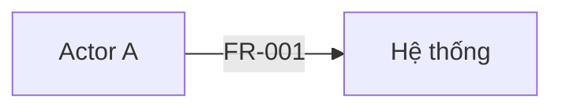
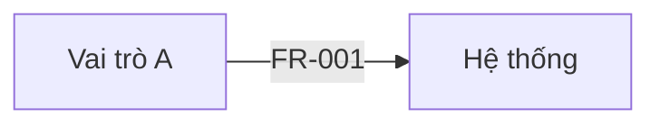

# SRS Template và Quy ước

**Mục đích:** nguồn sự thật duy nhất về cấu trúc SRS, quy ước ID, định dạng requirement và các sổ đăng ký. Validator (`scripts/validate_srs.py`) kiểm tra theo đúng file này.

**Khi dùng:** Phase 0 (tạo file SRS), Phase 3 (soạn), Phase 4 (rà soát), Phase 6 (cập nhật sau CR).

## Mục lục

- Phần A — Quy ước
  - A1. File và ngôn ngữ
  - A2. Danh sách section chuẩn
  - A3. Quy tắc `Not applicable`
  - A4. Ngữ pháp ID
  - A5. Định nghĩa và tham chiếu ID
  - A6. Khối requirement
  - A7. Priority và status
  - A8. Các sổ đăng ký (bảng)
  - A9. Document Control
  - A10. Khối sơ đồ
  - A11. Phê duyệt và version
  - A12. Ghi nhãn thông tin chưa xác nhận
- Phần B — Khung SRS (sao chép để bắt đầu)

---

## Phần A — Quy ước

### A1. File và ngôn ngữ

- Một SRS là **một file Markdown UTF-8**. Mặc định đặt tại `docs/srs/srs.md` (hỏi người dùng ở G0 nếu repo có quy ước khác).
- Khi duyệt, lưu thêm bản chụp `docs/srs/srs-vX.Y.md`, không sửa bản chụp đó nữa.
- Nội dung mặc định tiếng Việt; tên trường, giá trị status/priority, tiền tố ID và cú pháp phê duyệt giữ tiếng Anh để validator nhận diện.
- Heading section song ngữ: `## <số>. <English title> — <Tiếng Việt>`. Validator nhận section theo **số** và **English title**; phần tiếng Việt có thể đổi.

### A2. Danh sách section chuẩn

Mọi SRS có đủ 30 section, đúng số thứ tự. Cột "N/A" cho biết section có được ghi `Not applicable` hay không.

| # | English title | Tiếng Việt | ID định nghĩa tại đây | N/A |
|---|---|---|---|---|
| 1 | Document Control | Kiểm soát tài liệu | — | Không |
| 2 | Executive Summary | Tóm tắt | — | Không |
| 3 | Goals and Success Metrics | Mục tiêu và chỉ số thành công | GOAL | Không |
| 4 | Scope | Phạm vi | — | Không |
| 5 | Stakeholders and Users | Các bên liên quan và người dùng | — | Không |
| 6 | Glossary | Thuật ngữ | — | Có |
| 7 | Assumptions, Constraints and Dependencies | Giả định, ràng buộc và phụ thuộc | ASM | Không |
| 8 | Business Processes and Use Cases | Quy trình nghiệp vụ và use case | UC | Có |
| 9 | Functional Requirements | Yêu cầu chức năng | FR | Không |
| 10 | Business Rules | Quy tắc nghiệp vụ | BR | Có |
| 11 | Data Requirements | Yêu cầu dữ liệu | DR | Có |
| 12 | Interface and Integration Requirements | Yêu cầu giao tiếp và tích hợp | IR | Có |
| 13 | User Interface Requirements | Yêu cầu giao diện người dùng | UIR, UXP | Có |
| 14 | Non-Functional Requirements | Yêu cầu phi chức năng | NFR | Không |
| 15 | User Stories | User story | US | Có |
| 16 | Permissions | Phân quyền | — | Có |
| 17 | Lifecycle and State Transitions | Vòng đời và chuyển trạng thái | — | Có |
| 18 | Reports, Search, Exports and Notifications | Báo cáo, tìm kiếm, xuất dữ liệu và thông báo | — | Có |
| 19 | Security, Privacy, Audit and Retention | Bảo mật, quyền riêng tư, audit và lưu trữ | — | Có |
| 20 | Migration, Rollout and Operations | Chuyển đổi, triển khai và vận hành | — | Có |
| 21 | Models and Diagrams | Mô hình và sơ đồ | DIA | Không |
| 22 | Domain-Specific Considerations | Lưu ý đặc thù lĩnh vực | — | Có |
| 23 | Risks | Rủi ro | RISK | Không |
| 24 | Open Questions | Câu hỏi mở | Q | Không |
| 25 | Decision Log | Nhật ký quyết định | DEC | Không |
| 26 | Sources | Nguồn thông tin | SRC | Không |
| 27 | Elicitation Coverage | Độ phủ thu thập | — | Không |
| 28 | Traceability Matrix | Ma trận truy vết | — | Không |
| 29 | Approval Record | Hồ sơ phê duyệt | — | Không |
| 30 | Change Requests | Yêu cầu thay đổi | CR | Có |

Section 22 phải là `Not applicable` cho đến khi domain được người dùng xác nhận (xem `domain-discovery-guide.md`).

### A3. Quy tắc `Not applicable`

- Không xóa section. Section không áp dụng ghi đúng một dòng: `Not applicable — <lý do cụ thể>`.
- Lý do phải nói vì sao không áp dụng cho dự án này (ví dụ "sản phẩm chỉ có API, không có giao diện người dùng"), không ghi chung chung.
- Section rỗng (không nội dung, không `Not applicable`) là lỗi cần sửa.

### A4. Ngữ pháp ID

| Tiền tố | Ý nghĩa | Mẫu | Regex |
|---|---|---|---|
| GOAL | Mục tiêu | `GOAL-001` | `GOAL-\d{3}` |
| FR, BR, DR, IR, UIR, NFR | Requirement | `FR-001`, `FR-ABC-001` | `(FR\|BR\|DR\|IR\|UIR\|NFR)-([A-Z][A-Z0-9]{1,5}-)?\d{3}` |
| US | User story | `US-001` | `US-\d{3}` |
| UC | Use case | `UC-001` | `UC-\d{3}` |
| AC | Acceptance criterion | `AC-FR-001-01`, `AC-US-002-01` | `AC-<ID requirement hoặc US>-\d{2}` |
| DIA | Sơ đồ | `DIA-001` | `DIA-\d{3}` |
| ASM | Giả định | `ASM-001` | `ASM-\d{3}` |
| Q | Câu hỏi mở | `Q-001` | `Q-\d{3}` |
| RISK | Rủi ro | `RISK-001` | `RISK-\d{3}` |
| DEC | Quyết định | `DEC-001` | `DEC-\d{3}` |
| SRC | Nguồn thông tin | `SRC-001` | `SRC-\d{3}` |
| UXP | Đầu vào thiết kế | `UXP-001` | `UXP-\d{3}` |
| CR | Change request | `CR-001` | `CR-\d{3}` |

- Số luôn có đủ chữ số (`FR-001`, không phải `FR-1`).
- Mã module (tùy chọn) gồm 2–6 ký tự in hoa/số, bắt đầu bằng chữ cái.
- **Không tái sử dụng ID** đã dùng, kể cả khi requirement bị loại. Đổi status thành `Rejected` hoặc `Superseded`.

### A5. Định nghĩa và tham chiếu ID

Một ID được **định nghĩa** ở đúng một chỗ, theo một trong ba cách:

1. **Heading H3** bắt đầu bằng ID: `### FR-001 — <tên ngắn>` (dùng cho FR, BR, DR, IR, UIR, NFR, US, UC, DIA, CR).
2. **Ô đầu tiên của một dòng bảng** trong section sở hữu tiền tố đó: GOAL (§3), ASM (§7), UXP (§13), RISK (§23), Q (§24), DEC (§25), SRC (§26).
3. **Dòng AC** trong khối requirement hoặc user story cha: `- AC-FR-001-01: Given …, when …, then …`.

Mọi lần xuất hiện khác là **tham chiếu**. Tham chiếu tới ID chưa được định nghĩa là lỗi. ID trong khối code thường (không phải `mermaid`) bị bỏ qua; ID trong khối `mermaid` được tính là tham chiếu.

### A6. Khối requirement

Áp dụng cho FR, BR, DR, IR, UIR, NFR. Mỗi khối một nghĩa vụ duy nhất.

```markdown
### FR-001 — <Tên ngắn>
- **Statement:** Hệ thống phải <một nghĩa vụ có thể kiểm thử>.
- **Rationale:** <vì sao cần>
- **Source:** SRC-001
- **Priority:** Must
- **Status:** Proposed
- **Related:** UC-001, BR-001
- **Acceptance criteria:**
  - AC-FR-001-01: Given <bối cảnh>, when <hành động>, then <kết quả quan sát được>.
- **Verification:** Test
```

| Trường | Bắt buộc với | Ghi chú |
|---|---|---|
| Statement | Tất cả | Một câu "phải"; không mô tả giải pháp kỹ thuật |
| Rationale | Khuyến nghị | |
| Source | Tất cả | ID `SRC-`, có thể kèm `Q-`/`DEC-` |
| Priority | Tất cả | Xem A7 |
| Status | Tất cả | Xem A7 |
| Related | Khuyến nghị | ID liên quan |
| Acceptance criteria | FR (bắt buộc); BR, DR, IR, UIR (AC **hoặc** Verification) | Định nghĩa AC tại chỗ hoặc tham chiếu AC khác |
| Verification | NFR (bắt buộc); khuyến nghị cho loại khác | Test, Demonstration, Inspection, Analysis |
| Target, Metric, Category | NFR | Target có thể là `TBD (Q-xxx)` |
| Classification, Retention | DR (khi biết) | |
| Counterpart, Direction, Failure handling | IR (khi biết) | |
| Superseded by | Khi Status = Superseded | ID thay thế |

Khối **use case**:

```markdown
### UC-001 — <Tên use case>
- **Actors:** <vai trò>
- **Trigger:** <sự kiện khởi đầu>
- **Preconditions:** <điều kiện>
- **Main flow:** 1. … 2. …
- **Alternate flows:** …
- **Exception flows:** …
- **Postconditions:** …
- **Related:** FR-001
- **Source:** SRC-001
- **Status:** Proposed
```

Khối **user story** (xem `user-story-standard.md`):

```markdown
### US-001 — <Tên ngắn>
- **Story:** As a <vai trò>, I want <khả năng>, so that <giá trị>.
- **Related:** FR-001
- **Priority:** Must
- **Status:** Proposed
- **Acceptance criteria:**
  - AC-US-001-01: Given …, when …, then …
```

### A7. Priority và status

| Loại | Giá trị hợp lệ |
|---|---|
| Priority requirement / story | `Must`, `Should`, `Could`, `Won't` |
| Priority câu hỏi | `P0`, `P1`, `P2` |
| Status requirement / UC / story / sơ đồ | `Proposed`, `Confirmed`, `Approved`, `Deferred`, `Rejected`, `Superseded` |
| Status giả định | `Open`, `Confirmed`, `Rejected` |
| Status câu hỏi | `Open`, `Answered`, `Deferred`, `Risk accepted` |
| Status UXP | `Open`, `Confirmed`, `Superseded` |
| Status CR | `Proposed`, `Approved`, `Rejected`, `Deferred`, `Implemented` |
| Trạng thái coverage | `Answered`, `TBD`, `Not applicable`, `Deferred` |
| Trạng thái tài liệu | `DRAFT — NOT APPROVED`, `APPROVED`, `ON HOLD` |

Ý nghĩa status requirement:
- `Proposed`: do Claude hoặc BA đề xuất, chưa có người có thẩm quyền xác nhận.
- `Confirmed`: người có thẩm quyền đã xác nhận nội dung (ghi nguồn).
- `Approved`: thuộc một baseline đã được phê duyệt.

### A8. Các sổ đăng ký (bảng)

**Goals (§3)**

| ID | Goal | Success metric | Baseline | Target | Source | Status |
|---|---|---|---|---|---|---|

**Assumptions (§7)**

| ID | Assumption | Source | Confirm with | Status |
|---|---|---|---|---|

**Design inputs / UX brief (§13)** — `Type`: `Constraint`, `Preference`, `Reference`

| ID | Type | Description | Source | Status |
|---|---|---|---|---|

**Risks (§23)**

| ID | Risk | Impact | Likelihood | Mitigation | Owner | Status |
|---|---|---|---|---|---|---|

**Open questions (§24)** — `Ask whom` ghi vai trò nên trả lời

| ID | Question | Priority | Ask whom | Status | Answer / Notes |
|---|---|---|---|---|---|

**Decision log (§25)**

| ID | Date | Decision | Decided by (role, as stated) | Related |
|---|---|---|---|---|

**Sources (§26)** — `Type`: `Brief`, `Meeting`, `Document`, `Existing system`, `Public research`, `Other`

| ID | Type | Description | Date | Provided by (role) | Notes |
|---|---|---|---|---|---|

**Elicitation coverage (§27)** — một dòng cho mỗi section 2–22

| Section | Status | Notes / Q-ID |
|---|---|---|

**Traceability matrix (§28)**

| Goal / Source | Requirement | User story | Acceptance criteria | Diagram | Verification | Design ref | Test ref |
|---|---|---|---|---|---|---|---|

Hai cột cuối để trống cho các giai đoạn sau. Mọi requirement chưa `Rejected`/`Superseded` và mọi GOAL phải xuất hiện trong ma trận.

**Approval record (§29)** — `Decision`: `APPROVE`, `REQUEST CHANGES`, `HOLD`

| Version | Decision | Approver (role, as stated) | Date | Notes |
|---|---|---|---|---|

**Permissions (§16)** — giá trị ô: `Allow`, `Deny`, `Conditional (BR-xxx)`, `TBD (Q-xxx)`. Không bao giờ mặc định `Allow` khi chưa rõ.

**State transitions (§17)**

| From | Event / Trigger | Condition | To | Actor | Related |
|---|---|---|---|---|---|

### A9. Document Control

```markdown
| Field | Value |
|---|---|
| Project | <tên dự án> |
| Document version | 0.1 |
| Status | DRAFT — NOT APPROVED |
| Current phase | Phase 1 — Discovery |
| Last gate passed | G0 |
| Product type | <loại sản phẩm> |
| Domain | Not confirmed |
| Language | vi |
| Business owner | <vai trò> |
| Approver | <vai trò> |
| SRS location | docs/srs/srs.md |
| Skill version | srs-analysis 1.0.0 |
```

- `Domain` ghi `Not confirmed` cho đến khi người dùng xác nhận; sau đó ghi `Confirmed: <tên lĩnh vực>`.
- Ngay dưới bảng là `### Revision History` với bảng `| Version | Date | Author (role) | Changes |`.

### A10. Khối sơ đồ

Xem `diagram-standard.md` cho danh mục và điều kiện kích hoạt.

````markdown
### DIA-001 — Context diagram
- **Type:** Context
- **Source:** FR-001, IR-001
- **Status:** Proposed


````

Loại Mermaid được phép trong v1: `flowchart`, `graph`, `sequenceDiagram`, `stateDiagram-v2`, `stateDiagram`, `erDiagram`, `gantt`.

### A11. Phê duyệt và version

- Cú pháp chính thức tại G5 (version phải khớp bản đang trình):
  - `APPROVE SRS vX.Y` hoặc `DUYỆT SRS vX.Y`
  - `REQUEST CHANGES: <nội dung>` hoặc `YÊU CẦU SỬA: <nội dung>`
  - `HOLD` hoặc `TẠM DỪNG`
- Bản nháp: 0.1, 0.2, … Lần duyệt đầu: 1.0. Mỗi CR được duyệt: tăng số phụ (1.1, 1.2). Chỉ tăng số chính khi người duyệt quyết định tái baseline.
- Khi duyệt: đổi `Status` thành `APPROVED`, thêm dòng vào §29, cập nhật status requirement đã xác nhận thành `Approved`, lưu bản chụp.

### A12. Ghi nhãn thông tin chưa xác nhận

- Trong các section văn xuôi (§2–§6, §16–§22), câu nào chưa được xác nhận phải kèm ID giả định hoặc câu hỏi, ví dụ: "… (ASM-002)", "… chưa rõ (Q-004)".
- Đề xuất của Claude ghi rõ "Đề xuất:" ở đầu câu, hoặc nằm trong requirement có `Status: Proposed`.
- Không dùng dấu ngoặc vuông cho nhãn: validator coi `[...]` là placeholder chưa điền.

---

## Phần B — Khung SRS

Sao chép toàn bộ khối dưới đây vào file SRS mới, rồi thay mọi `[...]` bằng nội dung thật hoặc `Not applicable — <lý do>`.

~~~~markdown
# Software Requirements Specification — [Tên dự án]

## 1. Document Control — Kiểm soát tài liệu

| Field | Value |
|---|---|
| Project | [Tên dự án] |
| Document version | 0.1 |
| Status | DRAFT — NOT APPROVED |
| Current phase | Phase 0 — Intake |
| Last gate passed | None |
| Product type | [Loại sản phẩm] |
| Domain | Not confirmed |
| Language | vi |
| Business owner | [Vai trò] |
| Approver | [Vai trò] |
| SRS location | docs/srs/srs.md |
| Skill version | srs-analysis 1.0.0 |

### Revision History

| Version | Date | Author (role) | Changes |
|---|---|---|---|
| 0.1 | [Ngày] | [Vai trò] | Khởi tạo |

## 2. Executive Summary — Tóm tắt

[Vấn đề, bối cảnh, hiện trạng, kết quả mong muốn. Câu chưa xác nhận kèm ASM-/Q-.]

## 3. Goals and Success Metrics — Mục tiêu và chỉ số thành công

| ID | Goal | Success metric | Baseline | Target | Source | Status |
|---|---|---|---|---|---|---|
| GOAL-001 | [Mục tiêu] | [Cách đo] | [Hiện tại] | TBD (Q-001) | SRC-001 | Proposed |

## 4. Scope — Phạm vi

### In scope
- [Nội dung]

### Non-goals
- [Nội dung]

### Release boundaries
- [MVP và các giai đoạn sau]

## 5. Stakeholders and Users — Các bên liên quan và người dùng

| Stakeholder / Role | Responsibility | Decision authority | Characteristics |
|---|---|---|---|
| [Vai trò] | [Trách nhiệm] | [Quyền quyết định] | [Số lượng, tần suất, thiết bị, môi trường] |

## 6. Glossary — Thuật ngữ

| Term | Definition | Source |
|---|---|---|
| [Thuật ngữ] | [Định nghĩa] | SRC-001 |

## 7. Assumptions, Constraints and Dependencies — Giả định, ràng buộc và phụ thuộc

### Assumptions

| ID | Assumption | Source | Confirm with | Status |
|---|---|---|---|---|
| ASM-001 | [Giả định] | SRC-001 | [Vai trò] | Open |

### Constraints
- [Ràng buộc kèm nguồn]

### Dependencies
- [Phụ thuộc kèm nguồn]

## 8. Business Processes and Use Cases — Quy trình nghiệp vụ và use case

### UC-001 — [Tên use case]
- **Actors:** [Vai trò]
- **Trigger:** [Sự kiện]
- **Preconditions:** [Điều kiện]
- **Main flow:** [Các bước]
- **Alternate flows:** [Luồng thay thế]
- **Exception flows:** [Luồng lỗi]
- **Postconditions:** [Kết quả]
- **Related:** FR-001
- **Source:** SRC-001
- **Status:** Proposed

## 9. Functional Requirements — Yêu cầu chức năng

### FR-001 — [Tên ngắn]
- **Statement:** Hệ thống phải [nghĩa vụ].
- **Rationale:** [Lý do]
- **Source:** SRC-001
- **Priority:** Must
- **Status:** Proposed
- **Related:** UC-001
- **Acceptance criteria:**
  - AC-FR-001-01: Given [bối cảnh], when [hành động], then [kết quả].
- **Verification:** Test

## 10. Business Rules — Quy tắc nghiệp vụ

Not applicable — [lý do]

## 11. Data Requirements — Yêu cầu dữ liệu

Not applicable — [lý do]

## 12. Interface and Integration Requirements — Yêu cầu giao tiếp và tích hợp

Not applicable — [lý do]

## 13. User Interface Requirements — Yêu cầu giao diện người dùng

### Design Inputs (UX Brief)

| ID | Type | Description | Source | Status |
|---|---|---|---|---|
| UXP-001 | Preference | [Mong muốn] | SRC-001 | Open |

## 14. Non-Functional Requirements — Yêu cầu phi chức năng

### NFR-001 — [Tên ngắn]
- **Category:** [Hạng mục]
- **Statement:** Hệ thống phải [thuộc tính chất lượng].
- **Metric:** [Cách đo]
- **Target:** TBD (Q-001)
- **Source:** SRC-001
- **Priority:** Should
- **Status:** Proposed
- **Verification:** Test

## 15. User Stories — User story

Not applicable — [lý do]

## 16. Permissions — Phân quyền

| Action | [Vai trò A] | [Vai trò B] |
|---|---|---|
| [Hành động] | TBD (Q-001) | TBD (Q-001) |

## 17. Lifecycle and State Transitions — Vòng đời và chuyển trạng thái

Not applicable — [lý do]

## 18. Reports, Search, Exports and Notifications — Báo cáo, tìm kiếm, xuất dữ liệu và thông báo

Not applicable — [lý do]

## 19. Security, Privacy, Audit and Retention — Bảo mật, quyền riêng tư, audit và lưu trữ

[Nội dung hoặc Not applicable kèm lý do]

## 20. Migration, Rollout and Operations — Chuyển đổi, triển khai và vận hành

[Nội dung hoặc Not applicable kèm lý do]

## 21. Models and Diagrams — Mô hình và sơ đồ

### DIA-001 — Context diagram
- **Type:** Context
- **Source:** FR-001
- **Status:** Proposed



## 22. Domain-Specific Considerations — Lưu ý đặc thù lĩnh vực

Not applicable — domain chưa được xác nhận.

## 23. Risks — Rủi ro

| ID | Risk | Impact | Likelihood | Mitigation | Owner | Status |
|---|---|---|---|---|---|---|
| RISK-001 | [Rủi ro] | [Tác động] | [Khả năng] | [Giảm thiểu] | [Vai trò] | Open |

## 24. Open Questions — Câu hỏi mở

| ID | Question | Priority | Ask whom | Status | Answer / Notes |
|---|---|---|---|---|---|
| Q-001 | [Câu hỏi] | P1 | [Vai trò] | Open | |

## 25. Decision Log — Nhật ký quyết định

| ID | Date | Decision | Decided by (role, as stated) | Related |
|---|---|---|---|---|
| DEC-001 | [Ngày] | [Quyết định] | [Vai trò] | [ID] |

## 26. Sources — Nguồn thông tin

| ID | Type | Description | Date | Provided by (role) | Notes |
|---|---|---|---|---|---|
| SRC-001 | Brief | [Mô tả] | [Ngày] | [Vai trò] | |

## 27. Elicitation Coverage — Độ phủ thu thập

| Section | Status | Notes / Q-ID |
|---|---|---|
| 2. Executive Summary | TBD | |
| 3. Goals and Success Metrics | TBD | |
| 4. Scope | TBD | |
| 5. Stakeholders and Users | TBD | |
| 6. Glossary | TBD | |
| 7. Assumptions, Constraints and Dependencies | TBD | |
| 8. Business Processes and Use Cases | TBD | |
| 9. Functional Requirements | TBD | |
| 10. Business Rules | TBD | |
| 11. Data Requirements | TBD | |
| 12. Interface and Integration Requirements | TBD | |
| 13. User Interface Requirements | TBD | |
| 14. Non-Functional Requirements | TBD | |
| 15. User Stories | TBD | |
| 16. Permissions | TBD | |
| 17. Lifecycle and State Transitions | TBD | |
| 18. Reports, Search, Exports and Notifications | TBD | |
| 19. Security, Privacy, Audit and Retention | TBD | |
| 20. Migration, Rollout and Operations | TBD | |
| 21. Models and Diagrams | TBD | |
| 22. Domain-Specific Considerations | TBD | |

## 28. Traceability Matrix — Ma trận truy vết

| Goal / Source | Requirement | User story | Acceptance criteria | Diagram | Verification | Design ref | Test ref |
|---|---|---|---|---|---|---|---|
| GOAL-001 | FR-001 | | AC-FR-001-01 | DIA-001 | Test | | |
| GOAL-001 | NFR-001 | | | | Test | | |

## 29. Approval Record — Hồ sơ phê duyệt

| Version | Decision | Approver (role, as stated) | Date | Notes |
|---|---|---|---|---|

## 30. Change Requests — Yêu cầu thay đổi

Not applicable — chưa có baseline được phê duyệt.
~~~~
