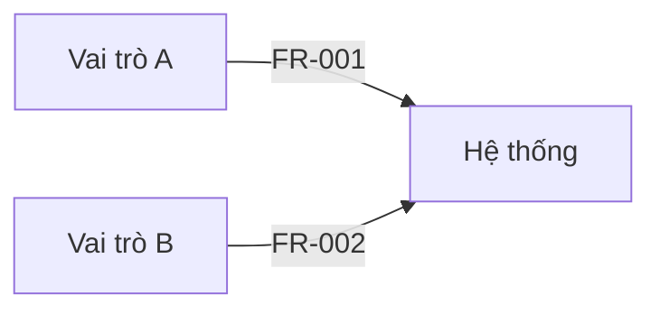
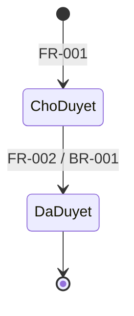

# Diagrams — Dự án thử nghiệm validator

> Fixture kiểm thử: nội dung trừu tượng, không thuộc lĩnh vực nào, không phải yêu cầu thật.

| Field | Value |
|---|---|
| Project | Dự án thử nghiệm validator |
| Document type | Diagrams |
| Document version | 0.3 |
| Status | DRAFT — NOT APPROVED |
| Current phase | Phase 4 — Self-review |
| Last gate passed | G2 |
| Related documents | docs/brd/brd.md, docs/srs/srs.md |
| Domain | Not confirmed |
| Language | vi |
| Skill version | srs-analysis 2.0.0 |

### Revision History

| Version | Date | Author (role) | Changes |
|---|---|---|---|
| 0.1 | 2026-10-01 | BA | Khởi tạo |
| 0.3 | 2026-10-05 | BA | Hoàn thiện bản nháp |

## 1. Diagrams — Sơ đồ

### DIA-001 — Context diagram
- **Type:** Context
- **Source:** FR-001, FR-002
- **Status:** Confirmed

### DIA-002 — Vòng đời đối tượng X
- **Type:** State
- **Source:** FR-002, BR-001
- **Status:** Confirmed

