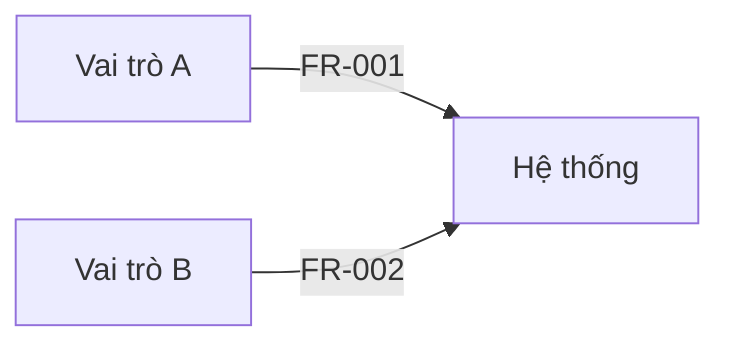
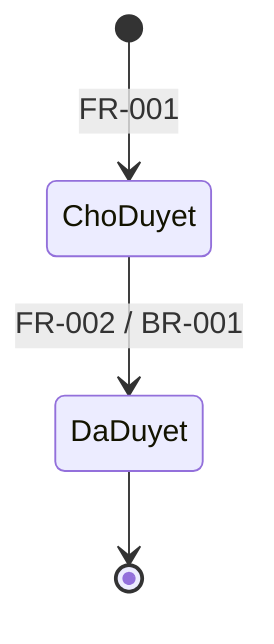

# Software Requirements Specification — Dự án thử nghiệm validator

> Fixture kiểm thử: nội dung trừu tượng, không thuộc lĩnh vực nào, không phải yêu cầu thật.

## 1. Document Control — Kiểm soát tài liệu

| Field | Value |
|---|---|
| Project | Dự án thử nghiệm validator |
| Document version | 0.3 |
| Status | DRAFT — NOT APPROVED |
| Current phase | Phase 4 — Self-review |
| Last gate passed | G2 |
| Product type | Ứng dụng web |
| Domain | Not confirmed |
| Language | vi |
| Business owner | Chủ nghiệp vụ |
| Approver | Chủ nghiệp vụ |
| SRS location | docs/srs/srs.md |
| Skill version | srs-analysis 1.0.0 |

### Revision History

| Version | Date | Author (role) | Changes |
|---|---|---|---|
| 0.1 | 2026-10-01 | BA | Khởi tạo |
| 0.3 | 2026-10-05 | BA | Hoàn thiện bản nháp |

## 2. Executive Summary — Tóm tắt

Vai trò A hiện xử lý đối tượng X thủ công. Hệ thống giúp vai trò A tạo và theo dõi đối tượng X, vai trò B duyệt đối tượng X.

## 3. Goals and Success Metrics — Mục tiêu và chỉ số thành công

| ID | Goal | Success metric | Baseline | Target | Source | Status |
|---|---|---|---|---|---|---|
| GOAL-001 | Rút ngắn thời gian xử lý đối tượng X | Thời gian từ lúc tạo đến lúc duyệt | 5 ngày | 2 ngày | SRC-001 | Confirmed |

## 4. Scope — Phạm vi

### In scope
- Tạo, xem, duyệt đối tượng X.

### Non-goals
- Tích hợp với hệ thống bên ngoài.

### Release boundaries
- Bản phát hành đầu gồm toàn bộ phạm vi trên.

## 5. Stakeholders and Users — Các bên liên quan và người dùng

| Stakeholder / Role | Responsibility | Decision authority | Characteristics |
|---|---|---|---|
| Chủ nghiệp vụ | Chịu trách nhiệm nghiệp vụ | Phê duyệt SRS | 1 người |
| Vai trò A | Tạo đối tượng X | Không | Khoảng 20 người, dùng hằng ngày |
| Vai trò B | Duyệt đối tượng X | Duyệt từng đối tượng | Khoảng 3 người |

## 6. Glossary — Thuật ngữ

| Term | Definition | Source |
|---|---|---|
| Đối tượng X | Bản ghi công việc do vai trò A tạo | SRC-001 |

## 7. Assumptions, Constraints and Dependencies — Giả định, ràng buộc và phụ thuộc

### Assumptions

| ID | Assumption | Source | Confirm with | Status |
|---|---|---|---|---|
| ASM-001 | Mọi người dùng có tài khoản trong hệ thống đăng nhập sẵn có | SRC-001 | Bộ phận IT | Confirmed |

### Constraints
- Phát hành trước ngày đã thống nhất (DEC-001).

### Dependencies
- Hệ thống đăng nhập sẵn có của tổ chức (ASM-001).

## 8. Business Processes and Use Cases — Quy trình nghiệp vụ và use case

### UC-001 — Tạo và duyệt đối tượng X
- **Actors:** Vai trò A, Vai trò B
- **Trigger:** Vai trò A cần ghi nhận một công việc mới
- **Preconditions:** Người dùng đã đăng nhập
- **Main flow:** 1. Vai trò A tạo đối tượng X. 2. Vai trò B duyệt.
- **Alternate flows:** Vai trò B từ chối, vai trò A sửa và gửi lại.
- **Exception flows:** Thiếu thông tin bắt buộc thì không gửi được.
- **Postconditions:** Đối tượng X ở trạng thái Đã duyệt hoặc Bị từ chối.
- **Related:** FR-001, FR-002
- **Source:** SRC-001
- **Status:** Confirmed

## 9. Functional Requirements — Yêu cầu chức năng

### FR-001 — Tạo đối tượng X
- **Statement:** Hệ thống phải cho phép vai trò A tạo đối tượng X với các trường bắt buộc đã thống nhất.
- **Rationale:** Thay cho ghi nhận thủ công.
- **Source:** SRC-001
- **Priority:** Must
- **Status:** Confirmed
- **Related:** UC-001, DR-001
- **Acceptance criteria:**
  - AC-FR-001-01: Given vai trò A đã đăng nhập, when gửi đối tượng X đủ trường bắt buộc, then đối tượng X được lưu ở trạng thái Chờ duyệt.
  - AC-FR-001-02: Given vai trò A đã đăng nhập, when gửi đối tượng X thiếu trường bắt buộc, then hệ thống từ chối và chỉ ra trường còn thiếu.
- **Verification:** Test

### FR-002 — Duyệt đối tượng X
- **Statement:** Hệ thống phải cho phép vai trò B duyệt hoặc từ chối đối tượng X đang chờ duyệt.
- **Source:** SRC-001
- **Priority:** Must
- **Status:** Confirmed
- **Related:** UC-001, BR-001
- **Acceptance criteria:**
  - AC-FR-002-01: Given đối tượng X ở trạng thái Chờ duyệt, when vai trò B duyệt, then đối tượng X chuyển sang Đã duyệt.
- **Verification:** Test

## 10. Business Rules — Quy tắc nghiệp vụ

### BR-001 — Không tự duyệt
- **Statement:** Người tạo đối tượng X không được duyệt chính đối tượng đó.
- **Source:** SRC-001
- **Priority:** Must
- **Status:** Confirmed
- **Verification:** Test

## 11. Data Requirements — Yêu cầu dữ liệu

### DR-001 — Lưu lịch sử trạng thái
- **Statement:** Hệ thống phải lưu lịch sử chuyển trạng thái của đối tượng X, gồm người thực hiện và thời điểm.
- **Source:** SRC-001
- **Priority:** Should
- **Status:** Confirmed
- **Classification:** Nội bộ
- **Acceptance criteria:**
  - AC-DR-001-01: Given đối tượng X vừa được duyệt, when xem lịch sử, then thấy người duyệt và thời điểm duyệt.

## 12. Interface and Integration Requirements — Yêu cầu giao tiếp và tích hợp

Not applicable — phạm vi đã loại trừ tích hợp với hệ thống bên ngoài (§4).

## 13. User Interface Requirements — Yêu cầu giao diện người dùng

### UIR-001 — Màu thương hiệu
- **Statement:** Giao diện phải dùng màu chủ đạo #1A73E8 theo guideline đã nhận.
- **Source:** SRC-002
- **Priority:** Should
- **Status:** Confirmed
- **Verification:** Inspection

### Design Inputs (UX Brief)

| ID | Type | Description | Source | Status |
|---|---|---|---|---|
| UXP-001 | Preference | Giao diện thoáng, ít màu | SRC-001 | Confirmed |

## 14. Non-Functional Requirements — Yêu cầu phi chức năng

### NFR-001 — Thời gian mở danh sách
- **Category:** Hiệu năng
- **Statement:** Hệ thống phải hiển thị danh sách đối tượng X trong thời gian đã thống nhất.
- **Metric:** Thời gian từ lúc mở trang đến lúc danh sách hiển thị
- **Target:** 3 giây với 95% lượt mở trong giờ làm việc
- **Source:** SRC-001
- **Priority:** Should
- **Status:** Confirmed
- **Verification:** Test

## 15. User Stories — User story

### US-001 — Tạo đối tượng X
- **Story:** As a vai trò A, I want tạo đối tượng X, so that công việc được ghi nhận và theo dõi.
- **Related:** FR-001
- **Priority:** Must
- **Status:** Confirmed
- **Acceptance criteria:** see AC-FR-001-01, AC-FR-001-02

## 16. Permissions — Phân quyền

| Action | Vai trò A | Vai trò B |
|---|---|---|
| Tạo đối tượng X | Allow | Deny |
| Duyệt đối tượng X | Deny | Conditional (BR-001) |

## 17. Lifecycle and State Transitions — Vòng đời và chuyển trạng thái

| From | Event / Trigger | Condition | To | Actor | Related |
|---|---|---|---|---|---|
| Chờ duyệt | Duyệt | Không phải người tạo | Đã duyệt | Vai trò B | FR-002, BR-001 |

## 18. Reports, Search, Exports and Notifications — Báo cáo, tìm kiếm, xuất dữ liệu và thông báo

Not applicable — chủ nghiệp vụ xác nhận chưa cần báo cáo hay thông báo trong bản phát hành này (DEC-001).

## 19. Security, Privacy, Audit and Retention — Bảo mật, quyền riêng tư, audit và lưu trữ

Đăng nhập qua hệ thống sẵn có (ASM-001). Lịch sử trạng thái theo DR-001.

## 20. Migration, Rollout and Operations — Chuyển đổi, triển khai và vận hành

Không có dữ liệu cũ cần chuyển. Triển khai một lần cho toàn bộ người dùng.

## 21. Models and Diagrams — Mô hình và sơ đồ

### DIA-001 — Context diagram
- **Type:** Context
- **Source:** FR-001, FR-002
- **Status:** Confirmed

### DIA-002 — Vòng đời đối tượng X
- **Type:** State
- **Source:** FR-002, BR-001
- **Status:** Confirmed

## 22. Domain-Specific Considerations — Lưu ý đặc thù lĩnh vực

Not applicable — domain chưa được xác nhận.

## 23. Risks — Rủi ro

| ID | Risk | Impact | Likelihood | Mitigation | Owner | Status |
|---|---|---|---|---|---|---|
| RISK-001 | Vai trò B vắng mặt làm chậm duyệt | Trung bình | Trung bình | Theo dõi trong vận hành | Chủ nghiệp vụ | Open |

## 24. Open Questions — Câu hỏi mở

| ID | Question | Priority | Ask whom | Status | Answer / Notes |
|---|---|---|---|---|---|
| Q-001 | Có cần báo cáo trong bản phát hành đầu không? | P1 | Chủ nghiệp vụ | Answered | Không cần (DEC-001) |

## 25. Decision Log — Nhật ký quyết định

| ID | Date | Decision | Decided by (role, as stated) | Related |
|---|---|---|---|---|
| DEC-001 | 2026-10-03 | Chưa làm báo cáo, thông báo trong bản phát hành đầu | Chủ nghiệp vụ | Q-001 |

## 26. Sources — Nguồn thông tin

| ID | Type | Description | Date | Provided by (role) | Notes |
|---|---|---|---|---|---|
| SRC-001 | Brief | Brief dự án thử nghiệm | 2026-10-01 | Chủ nghiệp vụ | |
| SRC-002 | Document | Guideline nhận diện thử nghiệm | 2026-10-02 | Chủ nghiệp vụ | |

## 27. Elicitation Coverage — Độ phủ thu thập

| Section | Status | Notes / Q-ID |
|---|---|---|
| 2. Executive Summary | Answered | |
| 3. Goals and Success Metrics | Answered | |
| 4. Scope | Answered | |
| 5. Stakeholders and Users | Answered | |
| 6. Glossary | Answered | |
| 7. Assumptions, Constraints and Dependencies | Answered | |
| 8. Business Processes and Use Cases | Answered | |
| 9. Functional Requirements | Answered | |
| 10. Business Rules | Answered | |
| 11. Data Requirements | Answered | |
| 12. Interface and Integration Requirements | Not applicable | Ngoài phạm vi |
| 13. User Interface Requirements | Answered | |
| 14. Non-Functional Requirements | Answered | |
| 15. User Stories | Answered | |
| 16. Permissions | Answered | |
| 17. Lifecycle and State Transitions | Answered | |
| 18. Reports, Search, Exports and Notifications | Not applicable | DEC-001 |
| 19. Security, Privacy, Audit and Retention | Answered | |
| 20. Migration, Rollout and Operations | Answered | |
| 21. Models and Diagrams | Answered | |
| 22. Domain-Specific Considerations | Not applicable | Domain chưa xác nhận |

## 28. Traceability Matrix — Ma trận truy vết

| Goal / Source | Requirement | User story | Acceptance criteria | Diagram | Verification | Design ref | Test ref |
|---|---|---|---|---|---|---|---|
| GOAL-001 | FR-001 | US-001 | AC-FR-001-01, AC-FR-001-02 | DIA-001 | Test | | |
| GOAL-001 | FR-002 | | AC-FR-002-01 | DIA-002 | Test | | |
| GOAL-001 | BR-001 | | | DIA-002 | Test | | |
| GOAL-001 | DR-001 | | AC-DR-001-01 | | Test | | |
| SRC-002 | UIR-001 | | | | Inspection | | |
| GOAL-001 | NFR-001 | | | | Test | | |

## 29. Approval Record — Hồ sơ phê duyệt

| Version | Decision | Approver (role, as stated) | Date | Notes |
|---|---|---|---|---|

## 30. Change Requests — Yêu cầu thay đổi

Not applicable — chưa có baseline được phê duyệt.
